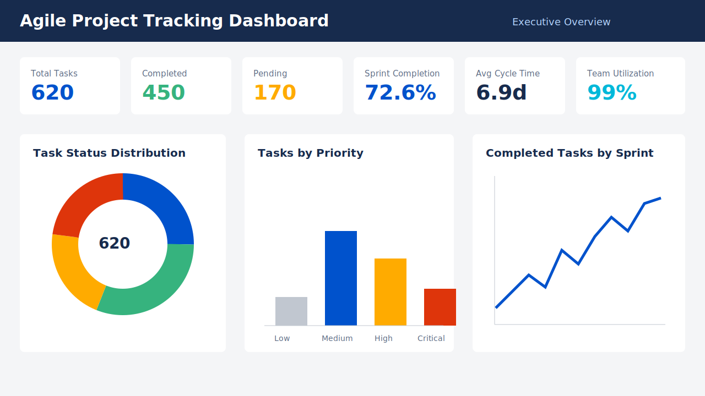
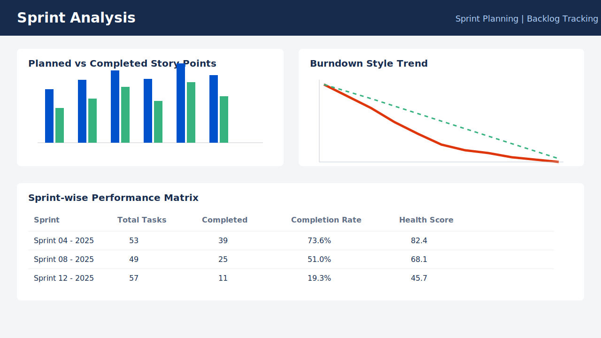
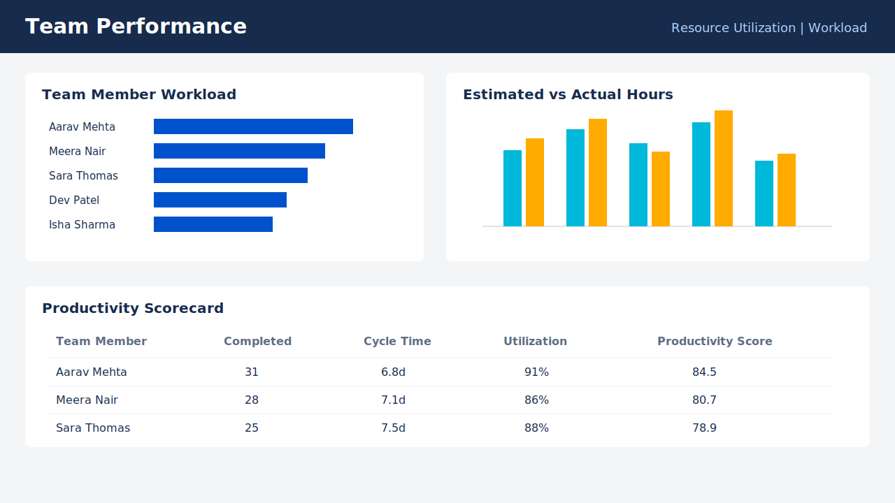
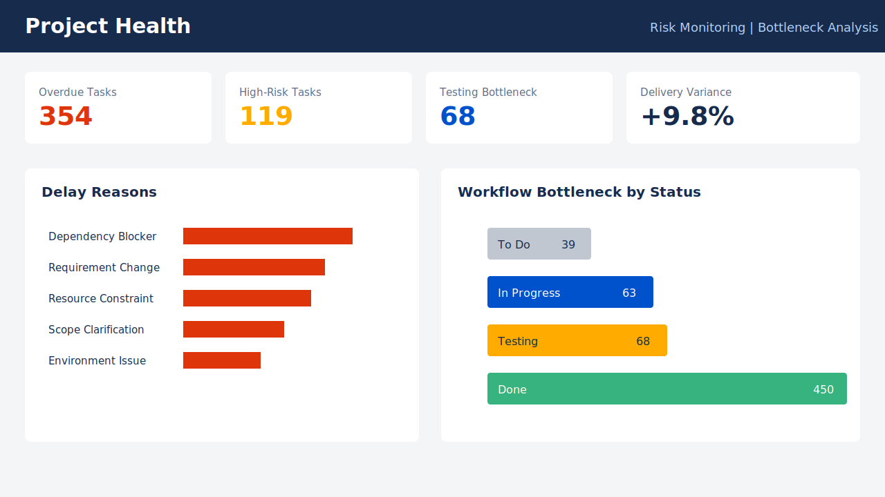

# Agile Project Tracking Dashboard

A Jira-inspired Agile Project Tracking Dashboard built with **Excel, Power BI, and DAX** to demonstrate sprint tracking, backlog monitoring, Scrum reporting, team utilization, and project health analysis.

This portfolio project is designed for final-year engineering students applying for:

- Scrum Intern
- Project Coordinator Intern
- Operations Intern
- Business Analyst Intern

## Project Overview

Agile teams need clear visibility into sprint progress, task completion, backlog movement, risks, and resource utilization. This project simulates a real Agile delivery environment and converts task-level project data into a Power BI reporting solution for stakeholder reporting and KPI monitoring.

The dashboard helps answer:

- Are sprint commitments being completed on time?
- Which tasks, epics, or departments are creating delivery risk?
- Which team members are over-utilized or under-utilized?
- Where are workflow bottlenecks appearing?
- What delay reasons are affecting project delivery?

## Repository Structure

```text
Agile-Project-Tracking-Dashboard/
|
├── Dataset/
│   ├── agile_project_tracking_dataset.xlsx
│   └── agile_project_tracking_dataset.csv
├── Dashboard/
│   ├── DAX_Measures.dax
│   └── PowerBI_Implementation_Guide.md
├── Documentation/
│   └── Project_Documentation.md
├── Images/
│   ├── executive_overview_mockup.svg
│   ├── sprint_analysis_mockup.svg
│   ├── team_performance_mockup.svg
│   └── project_health_mockup.svg
├── Scripts/
│   ├── generate_agile_dataset.py
│   └── generate_agile_dataset.mjs
└── README.md
```

## Tools Used

- **Microsoft Excel**: Dataset storage and review
- **Power BI**: Interactive dashboard and KPI reporting
- **DAX**: Professional measures for Agile and operations metrics
- **Python**: Dataset generation script
- **Node.js**: Dependency-free fallback dataset/workbook generator
- **GitHub**: Portfolio publishing and version control

## Dataset

The dataset contains **620 Agile task records** across multiple epics, sprints, team members, departments, priorities, risks, and task statuses.

Core columns:

- Task ID
- Epic
- Sprint Name
- Team Member
- Priority
- Story Points
- Task Status
- Start Date
- Due Date
- Completion Date
- Department
- Risk Level
- Estimated Hours
- Actual Hours

Additional analysis fields:

- Delay Reason
- Sprint Start Date
- Sprint End Date
- Cycle Time Days
- Is Overdue
- Completed Flag

## Dashboard Features

### Executive Overview

- Total Tasks
- Completed Tasks
- Pending Tasks
- Sprint Completion %
- Average Cycle Time
- Team Utilization %
- Task status and priority breakdown



### Sprint Analysis

- Sprint progress
- Story points planned vs completed
- Burndown-style remaining work trend
- Sprint-wise completion performance



### Team Performance

- Team member workload
- Task distribution by status
- Completion rate
- Estimated versus actual hours
- Resource utilization and productivity score



### Project Health

- Overdue tasks
- High-risk tasks
- Bottleneck analysis
- Delay reasons
- Delivery variance



## KPIs Tracked

- Total Tasks
- Completed Tasks
- Pending Tasks
- Task Completion Rate
- Sprint Completion Rate
- Story Points Completed
- Average Resolution Time
- Average Cycle Time
- Resource Utilization %
- Team Productivity Score
- Overdue Tasks
- High-Risk Tasks
- On-Time Delivery Rate
- Sprint Health Score

## DAX Measures

The project includes professional DAX measures in:

```text
Dashboard/DAX_Measures.dax
```

Example measures:

```DAX
Sprint Completion Rate =
DIVIDE(
    CALCULATE(COUNTROWS('Agile Tasks'), 'Agile Tasks'[Task Status] = "Done"),
    COUNTROWS('Agile Tasks'),
    0
)
```

```DAX
Resource Utilization % =
DIVIDE([Actual Hours], [Estimated Hours], 0)
```

```DAX
Team Productivity Score =
VAR CompletionComponent = [Task Completion Rate] * 50
VAR StoryPointComponent = [Story Point Completion Rate] * 30
VAR UtilizationComponent =
    MIN([Resource Utilization %], 1.2) / 1.2 * 20
RETURN
    CompletionComponent + StoryPointComponent + UtilizationComponent
```

## Business Impact

This dashboard supports Agile methodology and operations reporting by improving:

- Sprint planning visibility
- Backlog tracking discipline
- Stakeholder reporting quality
- KPI monitoring accuracy
- Workflow optimization
- Project delivery predictability
- Risk and bottleneck identification
- Resource allocation decisions

## Key Insights

- Sprint completion trends help identify whether teams are consistently delivering committed backlog items.
- Overdue and high-risk tasks should be reviewed during stand-ups and sprint reviews.
- Actual hours compared with estimated hours can highlight planning accuracy and resource pressure.
- Delay reason analysis helps identify recurring blockers such as dependencies, requirement changes, and resource constraints.
- Team-level workload reporting supports better sprint planning and project coordination.

## Business Recommendations

- Track sprint completion rate weekly and review missed commitments during retrospectives.
- Prioritize high-risk overdue tasks in Scrum ceremonies.
- Use delay reason analysis to reduce recurring project blockers.
- Balance workload using team utilization and productivity metrics.
- Monitor story point completion to improve sprint planning accuracy.
- Publish the dashboard to Power BI Service for stakeholder reporting.

## How to Recreate the Dataset

Python:

```bash
python Scripts/generate_agile_dataset.py
```

Node.js fallback:

```bash
node Scripts/generate_agile_dataset.mjs
```

## Power BI Build Steps

1. Open Power BI Desktop.
2. Import `Dataset/agile_project_tracking_dataset.xlsx`.
3. Load the `Agile Tasks` sheet.
4. Rename the table to `Agile Tasks`.
5. Add the DAX measures from `Dashboard/DAX_Measures.dax`.
6. Build the four dashboard pages using `Dashboard/PowerBI_Implementation_Guide.md`.
7. Export dashboard screenshots into the `Images` folder.

## Future Improvements

- Add a dedicated date dimension and sprint dimension.
- Connect the dashboard to Jira or Azure DevOps APIs.
- Add Power BI drill-through pages for epic-level analysis.
- Include sprint retrospective notes and blocker aging.
- Publish to Power BI Service with scheduled refresh.
- Add row-level security by department or Scrum team.

## Resume Summary

**Agile Project Tracking Dashboard**: Developed a Jira-inspired Power BI dashboard using Excel and DAX to monitor sprint progress, backlog tracking, task completion, resource utilization, delivery risks, and stakeholder reporting KPIs across 620 simulated Agile task records.
